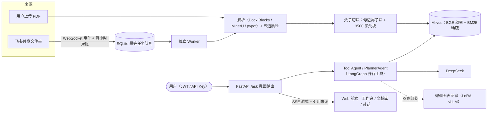

<div align="center">

# feishu-knowledge-agent

**飞书知识库 RAG Agent：增量同步 · 父子切块 · 混合检索 · 多用户隔离 · 微调图表专家**

[](https://github.com/luoluoluo0/feishu-knowledge-agent/actions/workflows/ci.yml)


把管理员指定的飞书共享文件夹自动同步成可检索的知识库，通过 LangGraph Agent
提供带原文引用的中文流式问答。支持飞书新版 Docx、PDF、WebSocket 事件、
每小时递归对账、SQLite 幂等任务队列、失败重试和 7 天软删除。

> 本项目是社区开源项目，与飞书或 Lark 官方无隶属、授权或背书关系。

</div>

## ✨ 项目亮点

- **飞书增量同步引擎**——WebSocket 事件 + 每小时递归对账双保险；文档更新走
  「旧快照 → 新块 → 查回质检 → 失败回滚」，同内容 SHA-256 去重；对账时按
  item_id 抽查向量库行数，台账与数据脱节自动重灌（自愈）。
- **父子切块 + 混合检索**——章节内按句边界切子块（检索粒度），聚合 3500 字
  父块（回答上下文）；Milvus 单集合双字段（BGE 稠密 + BM25 icu 稀疏）RRF
  融合，中文查询自动翻译以激活英文关键词通道。
- **七类意图路由的多业务 Agent**——知识库问答 / 文献元数据 / 总结论文 /
  总结 PPT / 对比分析 / 组会提纲 / 图表专家，自动分发 Tool Agent 或
  Planner 双链路；LangGraph 线程池并行执行同轮多工具调用。
- **多用户体系**——JWT 注册登录（pbkdf2 密码哈希）、thread 归属数据隔离
  （越权 403）、限流按凭证分桶（用户互不挤占）、请求日志按用户归因、
  工作台 Token 用量可视化。
- **微调图表专家**——Qwen2.5-7B LoRA 微调模型经 vLLM 以 OpenAI 兼容接口
  服务化，作为 Agent 的一个工具回答图表细节问题（颜色、方位、数值、构成）。
- **全链路可观测**——Langfuse 追踪每一次模型调用与工具往返；按意图分档的
  重排置信门槛；回答 👍👎 反馈落库；工作台实时展示个人 Token 用量。

## 🏗 架构



## 🎯 意图路由微调

为替换现网 LLM 意图分类调用（每次问答一次 API 往返），基于本项目真实
查询构建六分类数据集并微调 Qwen3-1.7B：

- **数据**：6,107 条 = 真实标注 394（评测集 + 陷阱集 + 生产查询）+ LLM
  蒸馏变体 5,713（六种风格轮换、生成即自检）；测试集 300 条冻结
  （SHA `0395060a`），所有模型在同一份考卷上评测。数据卡见
  `finetune/intent_route/data/data_card.md`。
- **结果**：闭卷准确率 **99.67%**（现网 DeepSeek 基线 95.67%），延迟
  429ms；seed 级对照量化泄漏 4.5pp；全新模式泛化 95.08%。
- **部署**：vLLM FP16 部署，16 并发压测 47.9 req/s；Ollama Q4/Q8 量化
  路线已验证。
- **数据说明**：数据集含真实姓名信息，不随仓库发布——构成与切分详见
  数据卡，脱敏样例见 `finetune/intent_route/data_samples/`，蒸馏 / 切分 /
  训练 / 评测 / 压测脚本见 `finetune/intent_route/scripts/`。

## 🚀 本地启动

官方支持 Python 3.11。Windows 建议使用独立的 3.11 虚拟环境，避免系统
Anaconda 中 `pyarrow` DLL 与 `pymilvus` 发生 ABI 冲突。

```powershell
py -3.11 -m venv .venv
.\.venv\Scripts\Activate.ps1
python -m pip install -r requirements-dev.txt
Copy-Item .env.example .env
```

填写 `.env` 中的模型、飞书和 API Key。随后启动 Milvus、API 与独立 Worker：

```powershell
docker compose -f docker-compose.milvus.yml up -d
python scripts/run_api.py
python -m app.feishu_sync.cli watch
```

也可以把三者一起放进 Docker：

```bash
docker compose up -d --build
```

需要自托管 Langfuse 时，再显式启用可选 profile，并先替换 `.env` 中的所有
Langfuse 数据库、加密和初始化密码：

```bash
docker compose --profile langfuse up -d --build
```

### 首次验证

先只扫描，不改 Milvus：

```powershell
python -m app.feishu_sync.cli sync --once
```

再由 Worker 处理当前待执行任务：

```powershell
python -m app.feishu_sync.cli worker --once
```

最后打开 `http://127.0.0.1:8030`，注册一个账号，询问刚同步文档里的独有
关键词；来源卡片应出现"打开飞书原文"。

## 🔐 认证与多用户

- `POST /auth/register` / `POST /auth/login` 注册登录，返回 JWT
  （HS256；密码经 pbkdf2 20 万轮加盐哈希存储，库中无明文）。
- **双轨认证**：问答端点接受 `Authorization: Bearer <JWT>`；管理端点
  （`/admin/*`）沿用 `X-API-Key`；旧脚本只带 API Key 也能走问答端点
  （落到预留的 service 身份）。
- **数据隔离**：thread 首次被某用户使用即登记归属，其他用户访问返回
  403；会话列表与历史恢复均经归属校验。
- **限流按凭证分桶**：JWT 用户各占独立额度，互不挤占。

## 📡 CLI 与管理 API

```text
python -m app.feishu_sync.cli sync --once    # 完整递归扫描并排队
python -m app.feishu_sync.cli worker --once  # 处理当前到期任务后退出
python -m app.feishu_sync.cli watch          # 启动事件、定时对账与 Worker
```

| 方法 | 路径 | 用途 |
|---|---|---|
| POST | `/auth/register` / `/auth/login` | 注册 / 登录，返回 JWT |
| GET | `/auth/me` / `/auth/sessions` | 当前身份 / 我的会话列表 |
| GET | `/auth/history/{thread_id}` | 恢复指定会话历史（归属校验） |
| GET | `/auth/library` | 文献库浏览（搜索 / 个人收藏标记） |
| GET | `/auth/stats` | 个人统计：会话 / 提问 / Token 用量 |
| POST | `/auth/feedback` | 回答 👍👎 反馈落库 |
| GET | `/tools` | Agent 工具清单 |
| GET | `/admin/logs` `/admin/stats` | 请求日志 / 运行统计 |
| POST | `/admin/clear-thread` | 清空指定会话记忆（本人或管理员） |
| GET/POST | `/admin/feishu-sync/*` | 同步状态 / 文档 / 任务 / 手动对账 |
| POST | `/admin/ingest` | 上传 PDF 走五道质检入库 |
| POST | `/ask/stream` | SSE 流式问答 |

`SERVICE_API_KEY` 是管理通道首选变量；旧部署中的 `FEISHU_SERVICE_API_KEY`
仍兼容。问答端点的限流额度用 `FEISHU_RATE_LIMIT_PER_MINUTE` 调整。

## 📦 同步语义

- 同一文件内容 SHA-256 未变化时不会重复生成向量。
- 对账时会按 item_id 抽查 Milvus 实际行数是否与本地镜像一致；向量库被
  重建或误删导致台账与数据脱节时，自动清空内容哈希并复活任务走重灌。
- 文档更新采用"保存旧快照 → 生成新块/向量 → 替换 → 查回质检"；失败会
  删除新块并恢复旧块。
- 事件明确删除时立即排队移出 Milvus；扫描首次未发现为 `suspect_missing`，
  连续两次才转 `soft_deleted`。
- 软删除保留 7 天，期间重新出现会自动恢复；过期后清理本地快照。
- 每次成功新增、更新或停用都会递增 `corpus_revision`，查询缓存和父块
  存储无需重启即可看到新内容。

## 🧪 测试

```bash
python -m pytest -q --ignore=tests/integration
python -m ruff check app tests scripts
```

- 单元测试覆盖检索、切块、意图路由、用户体系、限流分桶、上下文窗口、
  前后端契约等模块，双平台 CI + Milvus 集成测试 + secret 扫描。
- 真实飞书凭证测试只允许本地显式运行，不进入公共 CI。合成样例位于
  `examples/`。
- 检索与问答质量由内置评测脚本守护（挑战集语义评分、检索召回、LLM
  judge，见 `scripts/`）；评测数据集不随仓库发布。

## ⚠️ 已知限制

- 只支持 Docx 和 PDF；图片、附件只保留占位，扫描 PDF 需要安装 MinerU。
- SQLite 任务队列面向单实例 Worker，不适合横向扩容；后续可替换为
  Redis/Celery。业务数据同样为 SQLite 单机文件，多实例需迁移集中式库。
- 不实现用户级飞书权限映射；所有同步进来的语料为全体用户共享，用户
  隔离作用于会话与历史，而非知识库本身。PPTX、Sheets、Bitable 和 Wiki
  留待后续版本。
- MinerU 不存在时 `FEISHU_PDF_PARSER=auto` 会回退到 pypdf，扫描件可能
  无法提取。
- 微调图表专家需要自行部署 vLLM 服务（`CHART_EXPERT_*` 配置），未配置
  时该工具不注册。

## License

[MIT](LICENSE)
