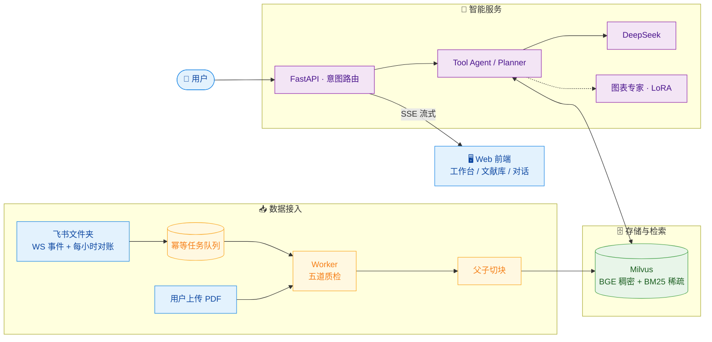

<div align="center">

# 📚 飞书知识库 RAG Agent

**把飞书文档变成一个会引用原文、能看懂图表、按账号隔离的多用户智能知识库**

[](https://github.com/luoluoluo0/feishu-knowledge-agent/actions/workflows/ci.yml)
[](LICENSE)


[功能总览](#-功能总览) · [架构](#-架构) · [意图路由微调](#-意图路由微调) · [认证与多用户](#-认证与多用户) · [快速开始](#-快速开始)

*增量同步 · 父子切块 · 混合检索 · JWT 多用户 · SSE 流式 · 微调图表专家*

> 本项目是社区开源项目，与飞书或 Lark 官方无隶属、授权或背书关系。

</div>

---

## ✨ 功能总览

| 模块 | 能做什么 | 背后机制 |
|---|---|---|
| 🔄 **增量同步引擎** | 飞书文件夹 → 知识库全自动，增删改实时跟进 | WebSocket 事件 + 每小时对账 + SQLite 幂等队列 + 五道质检回滚 |
| 🔍 **混合检索** | 中文提问直出带引用答案 | 父子切块（句边界子块 + 3500 字父块）+ Milvus 稠密/BM25 双通道 RRF 融合 |
| 🧭 **意图路由** | 七类问题自动分发最合适的处理链路 | 理解合并单次调用 + Tool Agent / Planner 双链路 + LangGraph 并行工具 |
| 👥 **多用户隔离** | 每个账号各自的会话、历史、Token 统计 | JWT + thread 归属登记，越权 403；限流按凭证分桶 |
| 📊 **图表专家** | 问图表的颜色、方位、数值、构成 | Qwen2.5-7B LoRA 微调模型，vLLM 服务化为 Agent 工具 |
| 🏠 **个人工作台** | 会话/提问/Token 用量一目了然，常用提问一键直达 | 请求日志按用户归因聚合 |
| 📚 **文献库** | 百篇级文献浏览、搜索、个人收藏 | 文献索引直查，收藏按用户隔离 |

> 🧪 以上全部能力由 **388 个自动化测试** 守护：双平台单元测试 + Milvus 集成
> 测试 + secret 扫描，CI 三作业全绿。

## 🏗 架构



**一次提问的完整旅程**：问题进入 → 意图理解与改写（合并单次调用）→
检索（翻译激活英文关键词 + 向量双通道 + 重排门槛）→ 父块回填上下文 →
带引用的流式回答。全过程在 Langfuse 可追踪，Token 用量在工作台可见。

## 🎯 意图路由微调

为替换现网 LLM 意图分类调用（每次问答一次 API 往返），基于本项目真实
查询构建六分类数据集并微调 Qwen3-1.7B：

| 指标 | 微调模型 | 现网基线（DeepSeek） |
|---|---|---|
| 闭卷准确率 | **99.67%** | 95.67% |
| 延迟 | **429ms** | ~1.4s |
| 全新模式泛化 | 95.08% | — |
| seed 级对照泄漏 | 仅 4.5pp | — |

- **数据**：6,107 条 = 真实标注 394（评测集 + 陷阱集 + 生产查询）+ LLM
  蒸馏变体 5,713（六种风格轮换、生成即自检）；测试集 300 条冻结
  （SHA `0395060a`），所有模型在同一份考卷上评测。
- **部署**：vLLM FP16 部署，16 并发压测 47.9 req/s；Ollama Q4/Q8 量化
  路线已验证。
- **数据说明**：数据集含真实姓名信息，不随仓库发布——构成与切分详见
  `finetune/intent_route/data/data_card.md`，脱敏样例见
  `finetune/intent_route/data_samples/`，蒸馏 / 切分 / 训练 / 评测 / 压测
  脚本见 `finetune/intent_route/scripts/`。

## 🔐 认证与多用户

- `POST /auth/register` / `POST /auth/login` 注册登录，返回 JWT
  （HS256；密码经 pbkdf2 20 万轮加盐哈希存储，库中无明文）。
- **双轨认证**：问答端点接受 `Authorization: Bearer <JWT>`；管理端点
  （`/admin/*`）沿用 `X-API-Key`；旧脚本只带 API Key 也能走问答端点
  （落到预留的 service 身份）。
- **数据隔离**：thread 首次被某用户使用即登记归属，其他用户访问返回
  403；会话列表与历史恢复均经归属校验。
- **限流按凭证分桶**：JWT 用户各占独立额度，互不挤占。

## 🚀 快速开始

<details open>
<summary><b>① 准备环境</b>（Python 3.11 · Windows 示例）</summary>

```powershell
py -3.11 -m venv .venv
.\.venv\Scripts\Activate.ps1
python -m pip install -r requirements-dev.txt
Copy-Item .env.example .env
```

> 建议使用独立 3.11 虚拟环境，避免系统 Anaconda 中 `pyarrow` DLL 与
> `pymilvus` 发生 ABI 冲突。

</details>

<details open>
<summary><b>② 配置并启动</b></summary>

填写 `.env` 中的模型、飞书和 API Key。随后启动 Milvus、API 与独立 Worker：

```powershell
docker compose -f docker-compose.milvus.yml up -d
python scripts/run_api.py
python -m app.feishu_sync.cli watch
```

也可以把三者一起放进 Docker：

```bash
docker compose up -d --build
```

需要自托管 Langfuse 时，再显式启用可选 profile，并先替换 `.env` 中的所有
Langfuse 数据库、加密和初始化密码：

```bash
docker compose --profile langfuse up -d --build
```

</details>

<details>
<summary><b>③ 接入飞书应用</b></summary>

1. 在飞书开放平台创建企业自建应用；
2. 开通云空间文件元数据只读、云文档内容读取、文件下载及事件订阅权限，
   发布新版本并等待管理员审批；
3. 在目标文件夹的协作者设置中添加该应用（至少可查看）；
4. 在"事件与回调"中选择长连接模式，订阅文件创建、编辑、标题更新、
   删除和移入回收站事件；
5. 从文件夹 URL 取得 folder token，填入 `FEISHU_FOLDER_TOKENS`（多个用
   英文逗号分隔）。

权限名称可能随飞书控制台调整，以接口页"权限要求"显示的名称为准。程序
若权限不足，会在管理接口保留飞书 Log ID，并自动降级到定时对账。

</details>

<details>
<summary><b>④ 首次验证</b></summary>

先只扫描，不改 Milvus：

```powershell
python -m app.feishu_sync.cli sync --once
```

再由 Worker 处理当前待执行任务：

```powershell
python -m app.feishu_sync.cli worker --once
```

最后打开 `http://127.0.0.1:8030`，注册一个账号，询问刚同步文档里的独有
关键词；来源卡片应出现"打开飞书原文"。

</details>

## 📡 CLI 与管理 API

```text
python -m app.feishu_sync.cli sync --once    # 完整递归扫描并排队
python -m app.feishu_sync.cli worker --once  # 处理当前到期任务后退出
python -m app.feishu_sync.cli watch          # 启动事件、定时对账与 Worker
```

<details>
<summary><b>全部 API 端点</b></summary>

| 方法 | 路径 | 用途 |
|---|---|---|
| POST | `/auth/register` / `/auth/login` | 注册 / 登录，返回 JWT |
| GET | `/auth/me` / `/auth/sessions` | 当前身份 / 我的会话列表 |
| GET | `/auth/history/{thread_id}` | 恢复指定会话历史（归属校验） |
| GET | `/auth/library` | 文献库浏览（搜索 / 个人收藏标记） |
| GET | `/auth/stats` | 个人统计：会话 / 提问 / Token 用量 |
| POST | `/auth/feedback` | 回答 👍👎 反馈落库 |
| GET | `/tools` | Agent 工具清单 |
| GET | `/admin/logs` `/admin/stats` | 请求日志 / 运行统计 |
| POST | `/admin/clear-thread` | 清空指定会话记忆（本人或管理员） |
| GET/POST | `/admin/feishu-sync/*` | 同步状态 / 文档 / 任务 / 手动对账 |
| POST | `/admin/ingest` | 上传 PDF 走五道质检入库 |
| POST | `/ask/stream` | SSE 流式问答 |

</details>

`SERVICE_API_KEY` 是管理通道首选变量；旧部署中的 `FEISHU_SERVICE_API_KEY`
仍兼容。问答端点的限流额度用 `FEISHU_RATE_LIMIT_PER_MINUTE` 调整。

## 📦 同步语义

- 同一文件内容 SHA-256 未变化时不会重复生成向量。
- 对账时会按 item_id 抽查 Milvus 实际行数是否与本地镜像一致；向量库被
  重建或误删导致台账与数据脱节时，自动清空内容哈希并复活任务走重灌。
- 文档更新采用"保存旧快照 → 生成新块/向量 → 替换 → 查回质检"；失败会
  删除新块并恢复旧块。
- 事件明确删除时立即排队移出 Milvus；扫描首次未发现为 `suspect_missing`，
  连续两次才转 `soft_deleted`。
- 软删除保留 7 天，期间重新出现会自动恢复；过期后清理本地快照。
- 每次成功新增、更新或停用都会递增 `corpus_revision`，查询缓存和父块
  存储无需重启即可看到新内容。

## 🧪 测试

```bash
python -m pytest -q --ignore=tests/integration
python -m ruff check app tests scripts
```

- 单元测试覆盖检索、切块、意图路由、用户体系、限流分桶、上下文窗口、
  前后端契约等模块，双平台 CI + Milvus 集成测试 + secret 扫描。
- 真实飞书凭证测试只允许本地显式运行，不进入公共 CI。合成样例位于
  `examples/`。
- 检索与问答质量由内置评测脚本守护（挑战集语义评分、检索召回、LLM
  judge，见 `scripts/`）；评测数据集不随仓库发布。

## 🗺 路线图

| 状态 | 事项 |
|---|---|
| ✅ | 增量同步引擎 · 父子切块混合检索 · 七类意图路由 · JWT 多用户隔离 |
| ✅ | 意图路由微调（99.67%）· 图表专家微调接入 · 工作台 / 文献库 |
| 🔜 | 用户上传文档直连入库管线（对象存储后端） |
| 🔜 | SQLAlchemy 统一数据访问层（MySQL 可切换） |
| ⏳ | PPTX / Sheets / Bitable / Wiki 支持 · Vue3 前端重构 |

## ⚠️ 已知限制

- 只支持 Docx 和 PDF；图片、附件只保留占位，扫描 PDF 需要安装 MinerU。
- SQLite 任务队列面向单实例 Worker，不适合横向扩容；后续可替换为
  Redis/Celery。业务数据同样为 SQLite 单机文件，多实例需迁移集中式库。
- 不实现用户级飞书权限映射；所有同步进来的语料为全体用户共享，用户
  隔离作用于会话与历史，而非知识库本身。
- MinerU 不存在时 `FEISHU_PDF_PARSER=auto` 会回退到 pypdf，扫描件可能
  无法提取。
- 微调图表专家需要自行部署 vLLM 服务（`CHART_EXPERT_*` 配置），未配置
  时该工具不注册。

## License

[MIT](LICENSE)
